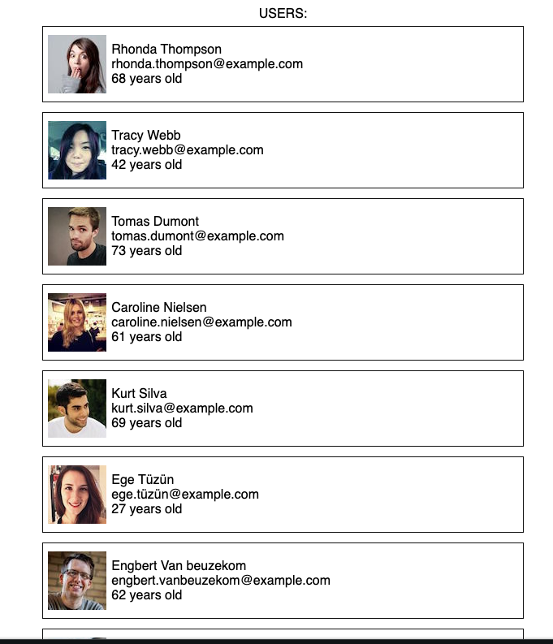

# fe-interview

Build a website that displays a list of users.  

Example

You can use any editor you want.  If you don't care codesandbox.io is a fast and easy way to get some code running.

Use the api at randomuser.me to get random user data  
(Or start with mocking the data)  

